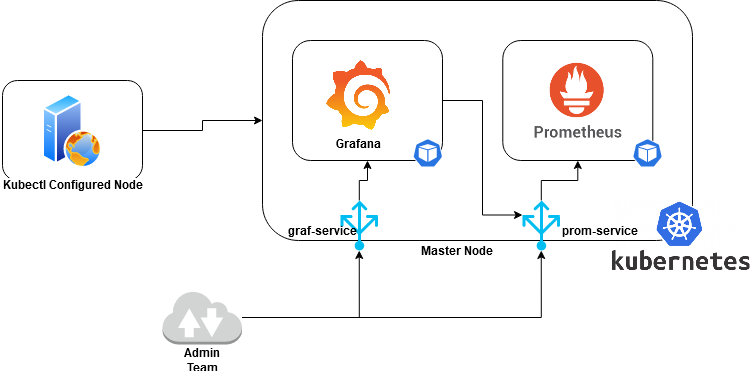
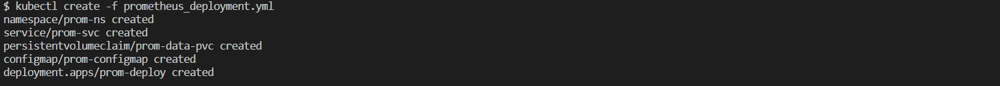
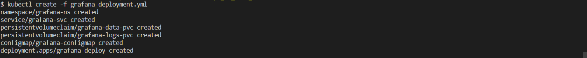
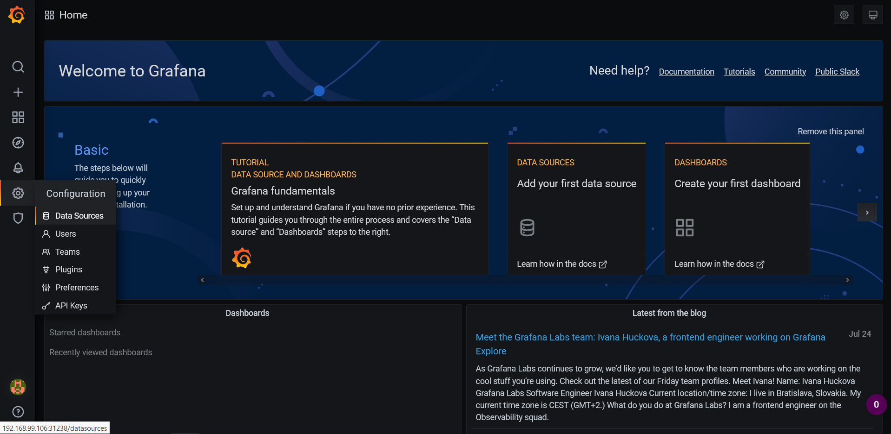
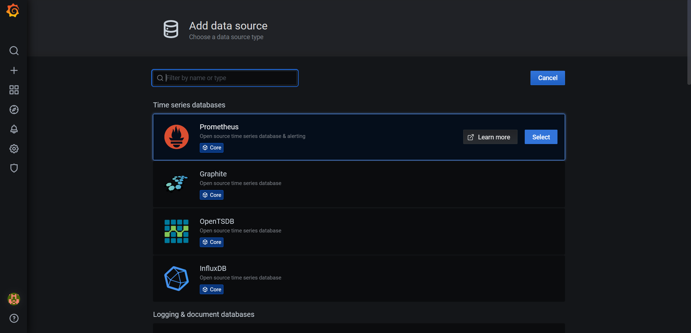
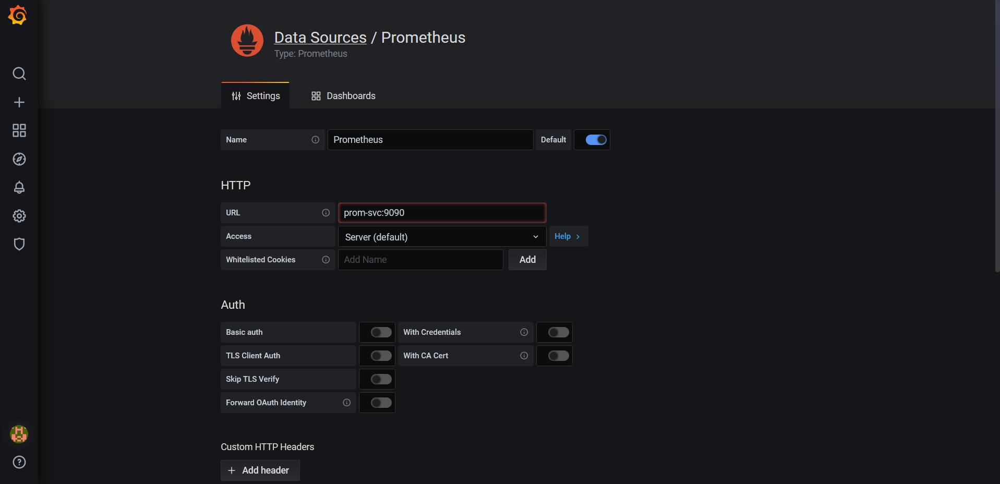
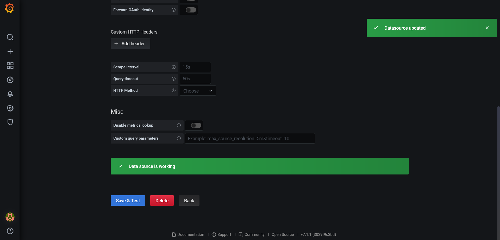
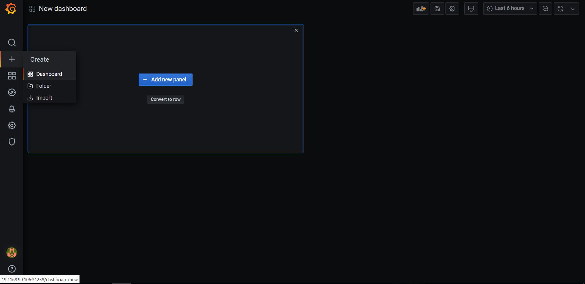
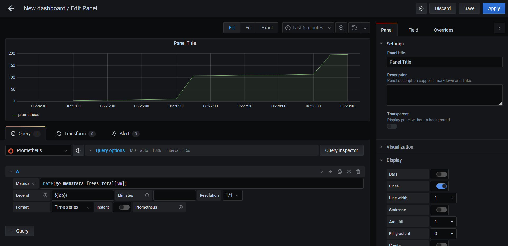

# Deployment of Grafana and Prometheus

The project consists of deployment steps and scripts for grafana and prometheus server on Kubernetes Cluster. Prometheus and Grafana applications are widely being used for monitoring of server metrics. Prometheus scraps the metrics from the server and Grafana visualises the metrics excellently.


**Project Infra Diagram**
<p align="center">
  
  <br>
  <em>Fig 1.: Project Flow  </em>
</p>


## Pre-Requisites
The following should be configured before proceeding further:

- Kubernetes Cluster

- Kubectl 


## Scope of Project

1. Container Image for Prometheus and Grafana Server
2. Deployment of Prometheus and Grafana Servers

### Prometheus Container Image

Prometheus is a free software application used for event monitoring and alerting. It records real-time metrics in a time series database built using a HTTP pull model, with flexible queries and real-time alerting. The `alpine linux` base operating system is used keeping in mind to minimise the size of image as much as possible. The prometheus server scraps the data or metrics from the target operating system. The difference between the two successive scrapes is defind by parameter `scrape_interval`. 

Command to install packages in `Alpine Linux`
```
apk add --no-cache --update prometheus -X  http://dl-cdn.alpinelinux.org/alpine/edge/community
```

The prometheus server stores the data i.e time series database at location `/var/lib/prometheus`. The prometheus server runs on `9090 port` by default. The Dockerfile is present in the repository at location `Dockerfiles` with name prometheus_dockerfile.

The prometheus server is started by executing the following command
```
/usr/bin/prometheus --config.file /etc/prometheus/prometheus.yml \ 
            --storage.tsdb.path /var/lib/prometheus/ \
            --web.console.libraries=/usr/share/prometheus/console_libraries \
            --web.console.templates=/usr/share/prometheus/consoles
```
> where prometheus.yml contains the configuration of the server.

### Grafana Container Image

Grafana is a multi-platform open source analytics and interactive visualization web application. It provides charts, graphs, and alerts for the web when connected to supported data sources. It is expandable through a plug-in system. End users can create complex monitoring dashboards using interactive query builders. 

Command to install packages in `Alpine Linux`
```
apk add --no-cache --update grafana -X  http://dl-cdn.alpinelinux.org/alpine/edge/testing
```

The grafana server details are as follows in `Alpine Linux package`

```
Grafana Configuration File : /etc/grafana.ini
Port                       : 3000
Data Directory             : /var/lib/grafana/
Log Directory              : /var/log/grafana
```


### Prometheus Server Deployment

The project deploys the prometheus container image i.e `riteshsoni296/prometheus_server:v1` over kubernetes cluster using kubectl. The data directories of the prometheus server are made persistent to prevent data loss in case of unavoidable circumstances. The kubernetes resources are launched in custom namespaces i.e prom-ns. 

**Prometheus Namespace Resource**

```
---
apiVersion: v1
kind: Namespace
metadata:
    name: prom-ns
```

**Prometheus Service Reosurce**

```
---
apiVersion: v1
kind: Service
metadata:
    name: prom-svc
    labels:
        app: prometheus
        type: Service
    namespace: monitoring-ns 
spec:
    selector:
        app: prometheus
        type: frontend
        tool: monitoring
    #clusterIP: None
    type: LoadBalancer
    ports:
    - name: container-port
      port: 9090
      protocol: TCP
```

where,
  - type            => represents service type i.e LoadBalancer, NodePort or ClusterIP
  - spec.ports.port => represent the application port


**Prometheus PVC Resource

```
apiVersion: v1
kind: PersistentVolumeClaim
metadata:
    name: prom-data-pvc
    labels:
        type: prom-data
        app: prometheus
    namespace: monitoring-ns
spec:
    accessModes:
    - ReadWriteOnce
    resources:
        requests:
            storage: 2Gi
```

The configuration file for prometheus is made persistent using `configMap` Kubernetes resource. The kubernetes reosurce configuration files is present in the repository at location `scripts` with name *prometheus_deployment.yml*

To create the reosurce, execute the following command
```
kubectl create -f scripts/prometheus_deployment.yml
```

<p align="center">
  
  <br>
  <em>Fig 2.: Prometheus resources </em>
</p>

### Grafana Server Deployment

The project deploys the grafana container image i.e `riteshsoni296/grafana_server:v1` over kubernetes cluster using kubectl. The data directories of the grafana server are made persistent to prevent data loss in case of unavoidable circumstances. The service resource configuration to access the grafana server from outside :

**Grafana Service Resource**
```
---
apiVersion: v1
kind: Service
metadata:
    name: grafana-svc
    labels:
        app: grafana
        tier: frontend
    namespace: monitoring-ns
spec:
    selector:
        app: grafana
        tier: frontend
        tool: monitoring
    type: LoadBalancer
    ports:
    - name: container-port
      port: 3000
      protocol: TCP
```

**Grafana PVC Resource for Grafana Logs and Grafana Data
```
apiVersion: v1
kind: PersistentVolumeClaim
metadata:
    name: grafana-data-pvc
    labels:
        type: grafana-data
        app: grafana
    namespace: monitoring-ns
spec:
    accessModes:
    - ReadWriteOnce
    resources:
        requests:
            storage: 2Gi
---
apiVersion: v1
kind: PersistentVolumeClaim
metadata:
    name: grafana-logs-pvc
    labels:
        type: grafana-logs
        app: grafana
    namespace: monitoring-ns
spec:
    accessModes:
    - ReadWriteOnce
    resources:
        requests:
            storage: 1Gi    
```

The configuration file for grafana is made persistent using `configMap` Kubernetes resource. The kubernetes reosurce configuration files is present in the repository at location `scripts` with name *grafana_deployment.yml*

To create the reosurce, execute the following command
```
kubectl create -f scripts/grafana_deployment.yml
```

<p align="center">
  
  <br>
  <em>Fig 3.: Grafana resources </em>
</p>


### Integration of Grafana with Prometheus

1. Grafana Server **Welcome Login Page**

<p align="center">
  
  <br>
  <em>Fig 4.: Login Page </em>
</p>

2. Change password on first time Login

<p align="center">
  
  <br>
  <em>Fig 5.: Change Admin Password </em>
</p>

3. Add Data Sources

<p align="center">
  
  <br>
  <em>Fig 6.: Grafana Welcome Page </em>
</p>

4. Add Prometheus Data Source

<p align="center">
  
  <br>
  <em>Fig 7.: Add Prometheus Data Source </em>
</p>

5. Configure **Data Source**

We can configure the Prometheus Data URL IP in two ways:

*a. Using Kubernetes Cluster IP*

   In case, when Prometheus Service is launched with type LoadBalancer or NodePort i.e it is exposed to world, then we need to configure the Prometheus HTTP URL as `<Kubernetes_clusterIP>:<service_NodePort>`. For example, if Kubernetes Cluster IP i.e in single node cluster is 192.168.99.106 and service node_port 31246, then HTTP URL will be `http://192.168.99.106:31246` 

*b. Using Prometheus Service Name*
    
   In case, when Prometheus service is launched with `clusterIP: None` parameter, then the prometheus service is not exposed to the world. In this case we can configure the HTTP UI as `<service_name>:<application_port_number>`
    
<p align="center">
  
  <br>
  <em>Fig 8.: Prometheus Data Source Configuration </em>
</p>

6. Verify the Data source Connection

<p align="center">
  
  <br>
  <em>Fig 9.: Verify Data Source </em>
</p>

7. Configure **New Dashboard**

<p align="center">
  
  <br>
  <em>Fig 10.: Add New Dashboard </em>
</p>

8. Add **New Panel**

<p align="center">
  
  <br>
  <em>Fig 11.: Add New Panel in Dashboard </em>
</p>


 > Source: LinuxWorld Informatics. Private Ltd.
 > 
 > Under Guidance of : Mr. [Vimal Daga](https://in.linkedin.com/in/vimaldaga)


